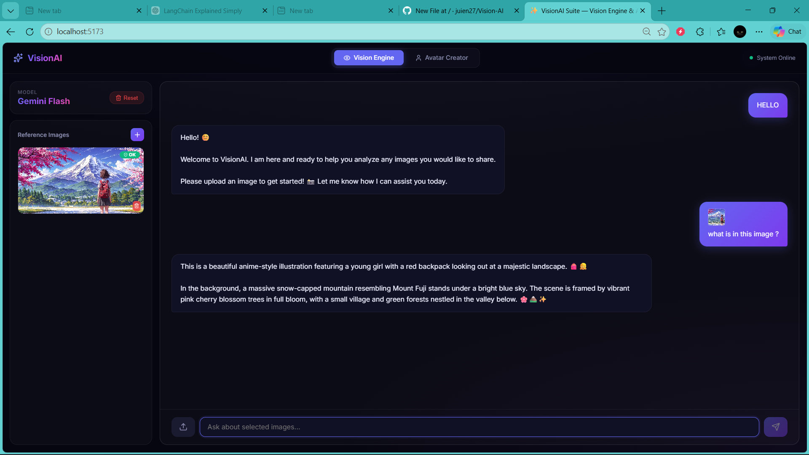
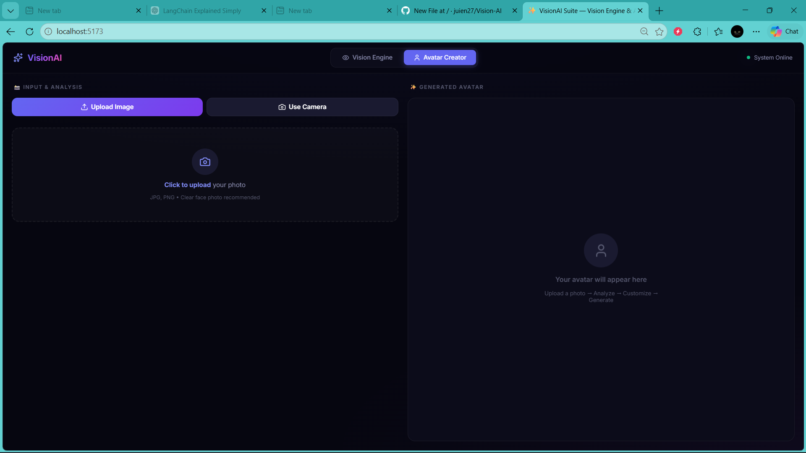
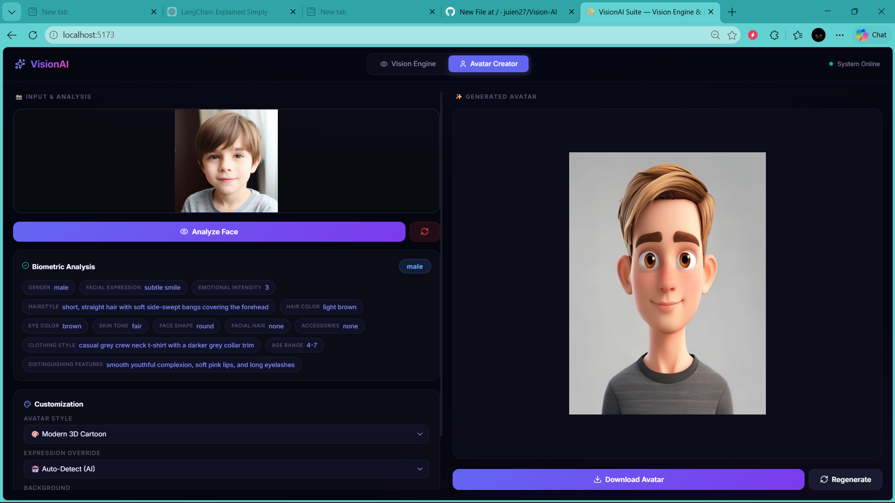

# VisionAI Suite

VisionAI Suite is a full-stack AI project with two core experiences in one app:

- `Vision Engine`: upload one or more images and ask questions about them.
- `Avatar Creator`: upload or capture a face photo, analyze facial traits, and generate a Bitmoji-style avatar.

The frontend is built with React + Vite, and the backend is built with FastAPI using Google Gemini for image understanding.

## Features

- Image-based question answering with Gemini
- Multi-image upload support
- Blur detection before image analysis
- Face analysis for avatar-ready traits
- Avatar generation with style, expression, and background controls
- Webcam capture flow in the frontend
- Downloadable generated avatars
- Lightweight API backend with simple local development

## Tech Stack

- Frontend: React 19, Vite, Framer Motion, Lucide React
- Backend: FastAPI, Uvicorn, OpenCV, Google Generative AI
- AI Services:
  - Google Gemini for vision analysis
  - Pollinations.ai for avatar image generation

## Project Structure

```text
VisionAI_Suite/
|-- backend/
|   |-- main.py
|   |-- requirements.txt
|   `-- ai_log.txt
|-- frontend/
|   |-- public/
|   |-- src/
|   |-- package.json
|   `-- vite.config.js
|-- package.json
`-- README.md
```

## How It Works

### Vision Engine

1. Upload one or more images.
2. Ask a vision-related question.
3. The backend validates the input, checks for blurry uploads, compresses images, and sends them to Gemini.
4. The answer is returned in the chat UI.

### Avatar Creator

1. Upload a face photo or capture one from the webcam.
2. The backend analyzes face features with Gemini.
3. The frontend lets you adjust style, expression, and background.
4. The backend builds a prompt and requests an avatar image from Pollinations.ai.
5. The generated avatar is shown in the UI and can be downloaded.

## Prerequisites

- Node.js 18+
- Python 3.9+
- A Google Gemini API key

## Environment Setup

Create a file at `backend/.env`:

```env
GEMINI_API_KEY=your_gemini_api_key_here
```

You can get a Gemini API key from Google AI Studio.

## Installation

### 1. Install frontend and root dependencies

From the project root:

```bash
npm run install:all
```

### 2. Install backend dependencies

From the `backend` folder:

```bash
pip install -r requirements.txt
pip install httpx
```

`httpx` is used by the avatar-generation endpoint and should be installed for the backend to run correctly.

## Running the Project

### Run both frontend and backend

From the project root:

```bash
npm run dev
```

### Run services separately

Backend:

```bash
python main.py 
```

Frontend:

```bash
npm run dev 
```

## Local URLs

- Frontend: `http://localhost:5173`
- Backend: `http://localhost:8000`

## 🖼️ Web Application Interface
### Vision Engine Interface


### Avatar Creator Interface



## API Endpoints

### `GET /`

Health check endpoint.

### `POST /ask`

Accepts:

- `question` as form data
- `images` as uploaded files

Used by the Vision Engine for image Q&A.

### `POST /analyze-face`

Accepts:

- `image` as an uploaded file

Returns detected facial features used for avatar generation.

### `POST /generate-avatar`

Accepts:

- `features` as JSON string form data
- `style`
- `expression`
- `background`

Returns a generated avatar image as a data URI or fallback image URL.

## Notes

- The backend allows all origins through CORS for local development.
- The app blocks person-identification prompts such as `identify person`.
- Blurry face images may be rejected to improve analysis quality.
- Avatar generation depends on an external free image service, so occasional slow responses or rate limits are possible.

## Troubleshooting

### Backend does not start

Check:

- `backend/.env` exists and contains a valid `GEMINI_API_KEY`
- Python dependencies are installed
- `httpx` is installed

### Frontend cannot reach backend

Make sure:

- the backend is running on port `8000`
- the frontend is calling `http://localhost:8000`

### Avatar generation fails

Possible reasons:

- temporary Pollinations.ai rate limiting
- internet connectivity issues
- invalid or blurry uploaded photo

## Scripts

Root `package.json` scripts:

- `npm run install:all` installs root and frontend packages
- `npm run backend` starts the FastAPI server
- `npm run frontend` starts the Vite app
- `npm run dev` runs both services together

## Future Improvements

- Add persistent chat history
- Add Docker support
- Add tests for backend endpoints
- Add environment variable support for frontend API base URL
- Improve dependency management in `backend/requirements.txt`

